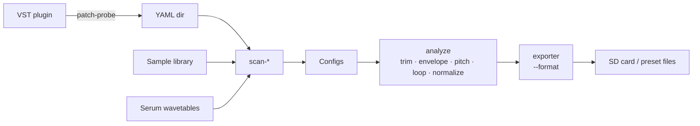

# patch-press

**Zero-manual-work sampler presets from VST plugins and sample libraries.**

patch-press turns things you already have — a VST folder, a downloaded sample library, a bank of Serum wavetables — into ready-to-play presets for hardware samplers. It handles the tedious parts: playing every note, trimming silence, finding a clean loop point, laying WAVs out in the right folder structure, writing the preset files each target expects.

The current release ships an exporter for the [Synthstrom Deluge](https://synthstrom.com/product/deluge/); the pipeline is format-agnostic and designed to grow additional targets over time.

The pipeline is one command per source. No YAML written by hand in the happy path.



---

## Start here

<div class="code-example" markdown="1">

**Have a VST folder?** → [VST workflow](inputs/vst-workflow.html) (patch-probe first, then `scan-from-probe`)

**Have a sample library?** → [Sample libraries](inputs/sample-libraries.html) (`scan-library`)

**Have Serum wavetables?** → [Wavetables](inputs/wavetables.html) (`scan-wavetables`)

**Not sure which command?** → [Inputs overview](inputs/) has a decision table.

</div>

---

## The 30-second version

```bash
# 1. Install
pip install -e .

# 2. Point patch-press at your sources → get one YAML config per preset
patch-press scan-library "~/samples/Mini From Mars" configs/Mini --type multisample

# 3. Run the pipeline → export to your target device's format
patch-press batch "configs/Mini/*.yaml" --path /media/DELUGE --format deluge
```

The scan commands write configs so you never have to. Editing a YAML is the escape hatch when an auto-detection got something wrong — one line change, re-run `sample`, done.

---

## What's on this site

- **[Install](install.html)** — Linux and macOS setup.
- **[Inputs](inputs/)** — every source type patch-press understands, with its own page.
- **[Pipeline](pipeline.html)** — what happens to your audio between input and output: trim, envelope, pitch, loop, normalize.
- **[Loop detection](loops.html)** — how patch-press finds loop points, why sometimes it doesn't, what to do when it picks a bad one.
- **[Outputs](outputs/)** — target-specific export formats. Currently: Deluge.
- **[Config reference](config-reference.html)** — the YAML schema you'll edit if you need to.
- **[CLI reference](cli-reference.html)** — every command and every flag.
