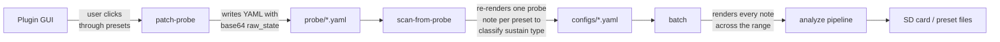

# VST workflow

VST plugins are the most involved source to work with, because VST plugins don't offer any standard way to enumerate their presets from outside the GUI. patch-press solves this in two steps: a companion tool called **patch-probe** captures preset state through the plugin's own GUI, then patch-press replays that state note-by-note to build a multisample.



## 1. Capture state with patch-probe

[patch-probe](https://github.com/blablack/patch-probe) is a small JUCE host that loads a plugin, lets you click through its preset browser, and captures the plugin's raw state blob every time you change presets. You run it once per plugin.

The output is a directory of YAML files — one per preset — each containing:

```yaml
preset_name: "BRASS   1"
plugin_path: "/path/to/Dexed.vst3"
raw_state: "<base64-encoded plugin state>"
timestamp: "..."
```

The `raw_state` is the important part. It's the plugin-defined blob that a plugin's own "restore state" call takes to reconstruct exactly what the user had loaded. patch-press hands this blob back to the plugin when it renders the preset — no preset-lookup, no name-matching, just a bit-exact restoration.

## 2. Turn probe YAMLs into configs

```bash
patch-press scan-from-probe ~/patch-probe/Dexed configs/Dexed
```

For each YAML in the probe directory, `scan-from-probe`:

1. Loads the plugin with that preset's `raw_state`.
2. Renders **one note** (default: MIDI 60 / C4, velocity 100) and holds it for `--duration` seconds (default: 15).
3. Analyzes the rendered audio to classify sustain type:
   - **pluck** — no meaningful sustain after the attack
   - **synth** — flat, steady sustain
   - **pad** — sustained but evolving (LFO, filter sweep, chorus movement)
4. Picks the matching profile.
5. Writes `configs/Dexed/BRASS_1.yaml` with `source.raw_state` baked in.

You get one config per preset. No further probing happens later — the full render only runs during `batch`.

## 3. Render and export

```bash
patch-press batch "configs/Dexed/*.yaml" --path /media/DELUGE --format deluge
```

For each config, `batch`:

1. Renders the plugin across `[start-note, end-note]` at `note-step` intervals (default: C1 to C6 every 3 semitones).
2. Runs the [analysis pipeline](../pipeline.html) — trim, envelope, loop detect, normalize.
3. Writes the preset in whatever `--format` you asked for — [Deluge XML in `SYNTHS/`, WAVs in `SAMPLES/`](../outputs/deluge.html), or a self-contained [Polyend Tracker `.pti`](../outputs/polyend.html) with `--format pti`.

If the output already exists, `batch` skips it. Use `--no-skip` to re-render.

## Full walkthrough: Dexed

```bash
# One-time: install patch-press and patch-probe.
pip install -e .

# Step 1 — capture presets. patch-probe opens a small GUI showing Dexed.
# Click through every preset you want to keep. Close the window when done.
patch-probe ~/.vst3/Dexed.vst3 ~/patch-probe/Dexed

# Step 2 — one config per preset.
patch-press scan-from-probe ~/patch-probe/Dexed configs/Dexed

# Step 3 — render everything to the SD card.
patch-press batch "configs/Dexed/*.yaml" --path /media/DELUGE --format deluge
```

That's it. Every Dexed preset you captured is now a Deluge synth preset with a full multisample (swap `--format pti` for a Polyend Tracker `.pti` instrument instead — see [Outputs](../outputs/)).

## `scan-from-probe` options

| Option | Default | What it does |
|---|---|---|
| `--profile pluck\|synth\|pad\|drums` | auto | Override the auto-detected profile. |
| `--sample-rate 44100\|48000\|96000` | 48000 | Rendering sample rate. Match your Deluge project's rate if you care about downsampling. |
| `--tempo-bpm BPM` | 120 | Tempo passed to the analysis stage for rhythm/LFO detection. |
| `--probe-note MIDI` | 60 | Which note gets rendered during the classification probe. |
| `--probe-velocity VEL` | 100 | Velocity used during the probe. |
| `--note-step INT` | 3 | Semitones between sampled notes at `batch` time (1 = every note; 12 = every octave). |
| `--duration FLOAT` | 15.0 | Probe hold length in seconds. Long enough to detect slow LFOs. |
| `--start-note NOTE` | C1 | Lowest note to capture at `batch` time. Accepts `C1`, `A#0`, MIDI numbers, etc. |
| `--end-note NOTE` | C6 | Highest note to capture at `batch` time. |

Global flags:

- `-v` / `--verbose` — show each preset as it's classified.
- `--debug` — process only 5 presets, useful when you're trying settings on a big directory.

## `raw_state` vs `preset` name

patch-press's config carries both:

```yaml
source:
  type: vst
  plugin: /path/to/Plugin.vst3
  preset: "BRASS   1"           # documentation only
  raw_state: "<base64 blob>"    # the real state
```

`raw_state`, when present, is what actually gets loaded — the `preset` name is just there for readability and filenames. If you're crafting a config by hand and you know a preset name will load correctly through the plugin's own preset API, you can omit `raw_state` and rely on `preset`, but plugins vary in how reliably that works. **The `raw_state` path is the reliable one.**

## Common issues

**Probe classifier picks the wrong profile.** Override with `--profile` on the scan, or edit `profile:` in the generated YAML and re-run `sample`.

**Plugin crashes patch-render partway through a batch.** `--workers 1` (default) processes one preset at a time; if a specific preset is toxic, `batch` prints an error and continues to the next. The bad preset's config file tells you which one to investigate.

**Notes bleed past the release tail.** Increase `capture.release_tail_s` in the config (the profile default is 2 seconds; pads go to 5). The Deluge doesn't need the plugin's full release to be baked in — you'll re-add release in the preset's amp envelope on the Deluge itself.
